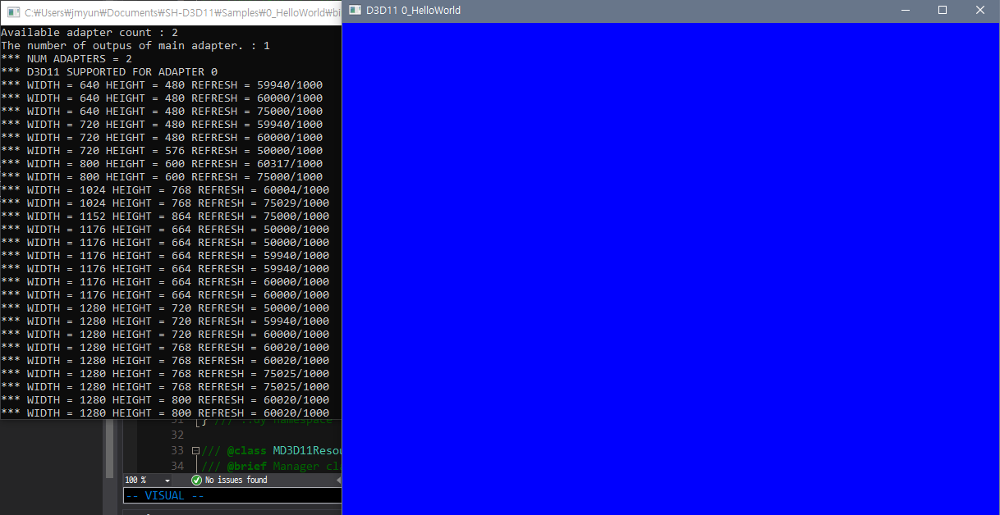
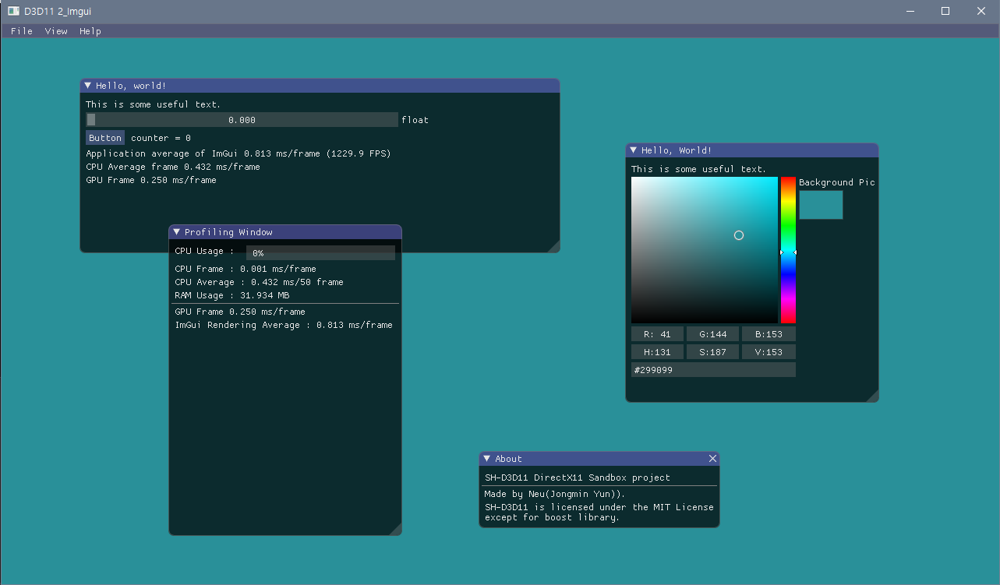
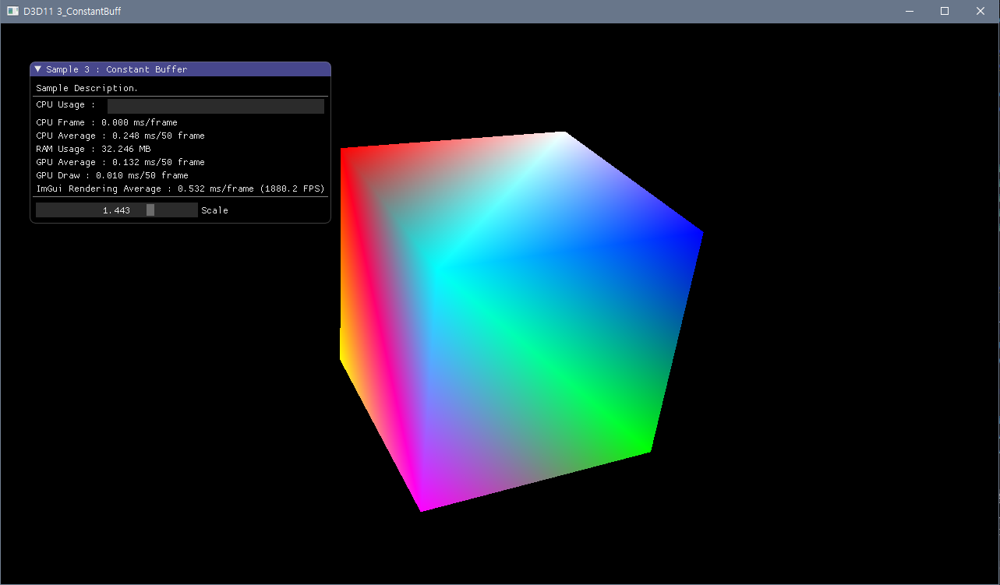

## SH-D3D11

Sandbox project of D3D11.

---

## Samples

| 0 : Hello World |    Create WIN32 windows and set up fundamental D3D11 Setting.  |
| --- | --- |
| 1 : ImGui |    Sample of `ImGui` Wrapping system. You can change background color with `View >> Background Picker`. |
| 2 : CostantBuff |    Box sample using constant buffer to control properties. You can control all values that is dependent on the box of screen. |

---

## Log

* 19-05-07 : Add README
* 19-05-11 : Update README

---

## License

All source code except for boost-dependent code have MIT license.

///  
/// MIT License  
/// Copyright (c) 2018-2019 Jongmin Yun  
///  
/// THE SOFTWARE IS PROVIDED "AS IS", WITHOUT WARRANTY OF ANY KIND, EXPRESS OR  
/// IMPLIED, INCLUDING BUT NOT LIMITED TO THE WARRANTIES OF MERCHANTABILITY,  
/// FITNESS FOR A PARTICULAR PURPOSE AND NONINFRINGEMENT. IN NO EVENT SHALL THE  
/// AUTHORS OR COPYRIGHT HOLDERS BE LIABLE FOR ANY CLAIM, DAMAGES OR OTHER  
/// LIABILITY, WHETHER IN AN ACTION OF CONTRACT, TORT OR OTHERWISE, ARISING FROM,   
/// OUT OF OR IN CONNECTION WITH THE SOFTWARE OR THE USE OR OTHER DEALINGS IN THE  
/// SOFTWARE.  
///  
